# Ticket #059: Fix History Loading in Docker Web Deployment

**Status:** 🐛 Bug Fix Ready
**Priority:** High
**Complexity:** Medium
**Estimated Effort:** 1-2 hours
**Created:** 2025-10-12
**Persistence Validated:** ✅ 2025-10-12 - Manual deployment test confirmed file persistence works correctly

---

## 📋 Executive Summary

The My Jarvis Desktop application works perfectly in Electron mode, but when deployed to Docker/Render, the **History feature gets stuck on "Loading project..."** indefinitely. This ticket documents the root cause analysis and provides a complete fix.

**Persistence Status:**
- ✅ **Render Persistent Disk**: Validated working - files persist across deployments
- ✅ **File System**: `/workspace` volume mount functioning correctly

**History Loading Status:**
- ✅ **Electron Desktop**: History works perfectly
- ❌ **Docker Web**: History stuck on loading screen (configuration issue, not persistence)
- ❌ **User Experience**: Cannot access conversation history in web deployment

---

## 🎯 Problem Statement

### What Users Experience

When clicking the **History** button in the Docker web deployment:

```
1. User clicks "History" button
2. Screen shows "Loading project..." spinner
3. Spinner runs forever - never loads conversations
4. User cannot access any conversation history
```

In contrast, the **same code** works perfectly in the Electron desktop app.

---

## 🔍 Root Cause Analysis

### The Architecture Difference

The application has **two deployment modes** with different filesystem architectures:

#### **Electron Desktop (Working)**
```
User's Home Directory: /Users/erezfern/
├── .claude.json              ← Project configuration
└── .claude/
    └── projects/
        └── -Users-erezfern-Workspace-my-jarvis/  ← Conversation history
            ├── session-abc123.json
            ├── session-def456.json
            └── ...
```

#### **Docker Container (Broken)**
```
Container Root: /root/
├── .claude.json              ← ❌ MISSING!
└── .claude/
    └── projects/             ← ❌ EMPTY!

Workspace: /workspace/
└── .claude/                  ← ✅ EXISTS but backend doesn't look here!
```

### Why This Breaks History

The backend code uses **Node.js `os.homedir()`** which returns:
- **Electron**: `/Users/erezfern/` ✅ (your actual home)
- **Docker**: `/root/` ❌ (container's root user)

The backend **always looks in the home directory** for `.claude` configuration:

**File: `lib/claude-webui-server/handlers/projects.ts` (Line 21)**
```typescript
const claudeConfigPath = `${homeDir}/.claude.json`;  // Always uses home directory!
```

**File: `lib/claude-webui-server/history/pathUtils.ts` (Line 21)**
```typescript
const projectsDir = `${homeDir}/.claude/projects`;  // Always uses home directory!
```

### The Failure Chain

Here's exactly what happens when history fails to load:

```mermaid
graph TD
    A[User Clicks History Button] --> B[Frontend: Call GET /api/projects]
    B --> C[Backend: Read ~/.claude.json]
    C --> D{File Exists?}
    D -->|No| E[Return Empty Array]
    E --> F[Frontend: encodedName = null]
    F --> G[HistoryView: if !encodedName]
    G --> H[Show: Loading project...]
    H --> I[STUCK FOREVER ❌]

    D -->|Yes| J[Return Projects List]
    J --> K[Frontend: encodedName = '-workspace-my-jarvis']
    K --> L[Call GET /api/projects/:name/histories]
    L --> M[Show Conversations ✅]

    style I fill:#ff6b6b
    style M fill:#51cf66
```



---

## 🏗️ Architecture Diagrams

### Current State (Broken)

```
┌─────────────────────────────────────────────────────────────┐
│                     DOCKER CONTAINER                         │
│                                                              │
│  ┌────────────────────────────────────────────────────┐    │
│  │  Node.js Process (Backend Server)                  │    │
│  │  HOME=/root                                        │    │
│  │                                                     │    │
│  │  Looking for:                                      │    │
│  │  • /root/.claude.json ❌ NOT FOUND                 │    │
│  │  • /root/.claude/projects/ ❌ NOT FOUND            │    │
│  └────────────────────────────────────────────────────┘    │
│                                                              │
│  ┌────────────────────────────────────────────────────┐    │
│  │  Workspace Directory (/workspace)                   │    │
│  │                                                     │    │
│  │  Actually exists:                                  │    │
│  │  • /workspace/.claude/ ✅ EXISTS                   │    │
│  │  • /workspace/my-jarvis/ ✅ EXISTS                 │    │
│  │                                                     │    │
│  │  But backend never looks here! ❌                  │    │
│  └────────────────────────────────────────────────────┘    │
│                                                              │
└─────────────────────────────────────────────────────────────┘

Result: GET /api/projects → { projects: [] } → encodedName = null → STUCK
```

### Target State (Fixed)

```
┌─────────────────────────────────────────────────────────────┐
│                     DOCKER CONTAINER                         │
│                                                              │
│  ┌────────────────────────────────────────────────────┐    │
│  │  Node.js Process (Backend Server)                  │    │
│  │  HOME=/root                                        │    │
│  │                                                     │    │
│  │  Looking for:                                      │    │
│  │  • /root/.claude.json ✅ CREATED BY INIT SCRIPT    │    │
│  │  • /root/.claude/projects/ ✅ CREATED              │    │
│  │    └── -workspace-my-jarvis/ ✅ READY FOR HISTORY │    │
│  └────────────────────────────────────────────────────┘    │
│                                                              │
│  ┌────────────────────────────────────────────────────┐    │
│  │  Workspace Directory (/workspace)                   │    │
│  │                                                     │    │
│  │  • /workspace/my-jarvis/ ✅ PROJECT FILES          │    │
│  │                                                     │    │
│  │  Config points here: /root/.claude.json            │    │
│  │  {                                                 │    │
│  │    "projects": {                                   │    │
│  │      "/workspace/my-jarvis": {}                    │    │
│  │    }                                               │    │
│  │  }                                                 │    │
│  └────────────────────────────────────────────────────┘    │
│                                                              │
└─────────────────────────────────────────────────────────────┘

Result: GET /api/projects → { projects: [{path, encodedName}] } → WORKS! ✅
```

---

## 🔧 Solution Implementation

### Overview

Create a new initialization script that sets up the `.claude` directory structure in the container's home directory (`/root/`) where the backend expects it.

### Step 1: Create Init Script

**File: `scripts/init-claude-config.sh`**

```bash
#!/bin/bash
set -e

echo "[Claude Init] Setting up .claude directory structure..."

# Create .claude directory in container's home directory (where backend expects it)
mkdir -p /root/.claude/projects

# Create .claude.json config file with workspace project
cat > /root/.claude.json <<'EOF'
{
  "projects": {
    "/workspace/my-jarvis": {}
  }
}
EOF

echo "[Claude Init] Created /root/.claude.json with workspace project"

# Create encoded project directory for history storage
# Path encoding: "/workspace/my-jarvis" → "-workspace-my-jarvis"
# (Claude converts '/', '\', ':', '.' to '-')
ENCODED_NAME="-workspace-my-jarvis"
mkdir -p "/root/.claude/projects/$ENCODED_NAME"

echo "[Claude Init] Created project history directory: /root/.claude/projects/$ENCODED_NAME"
echo "[Claude Init] .claude structure ready:"
ls -la /root/.claude/
ls -la /root/.claude/projects/

exit 0
```

**What This Script Does:**

1. **Creates `/root/.claude/projects/`** - Where backend stores conversation history
2. **Creates `/root/.claude.json`** - Configuration file that tells backend about projects
3. **Creates encoded project directory** - Empty directory ready to store conversation files
4. **Uses correct path encoding** - Matches Claude's path→directory name conversion logic

### Step 2: Update Dockerfile

**File: `Dockerfile` (Add before CMD)**

```dockerfile
# Copy and prepare Claude config initialization script
COPY scripts/init-claude-config.sh /app/scripts/init-claude-config.sh
RUN chmod +x /app/scripts/init-claude-config.sh

# Start the backend server with proper initialization
CMD ["/bin/bash", "-c", "/app/scripts/init-workspace.sh && /app/scripts/init-claude-config.sh && node /app/lib/claude-webui-server/dist/cli/node.js --port 10000 --host 0.0.0.0"]
```

**Changes:**
- Copies the new init script into the container
- Makes it executable
- Runs **both** init scripts before starting the server
- Order: workspace init → claude config init → start server

---

## 📊 Before vs After Comparison

### API Response Comparison

#### **Before (Broken)**

**Request:** `GET /api/projects`

**Response:**
```json
{
  "projects": []
}
```

**Frontend Impact:**
- `encodedName` becomes `null`
- `HistoryView` shows "Loading project..." forever
- History functionality completely broken

---

#### **After (Fixed)**

**Request:** `GET /api/projects`

**Response:**
```json
{
  "projects": [
    {
      "path": "/workspace/my-jarvis",
      "encodedName": "-workspace-my-jarvis"
    }
  ]
}
```

**Frontend Impact:**
- `encodedName` is `"-workspace-my-jarvis"`
- `HistoryView` calls `/api/projects/-workspace-my-jarvis/histories`
- Backend finds `/root/.claude/projects/-workspace-my-jarvis/`
- Returns conversation list (empty initially, but loads correctly)
- Users can create conversations and history accumulates

---

## ✅ Testing & Validation Checklist

### Pre-Deployment Testing

- [ ] Build Docker image with new init script
- [ ] Run container locally with `docker-compose up`
- [ ] Check container logs for init script success messages
- [ ] Verify `/root/.claude.json` exists in running container
- [ ] Verify `/root/.claude/projects/-workspace-my-jarvis/` exists
- [ ] Test `/api/projects` endpoint returns non-empty array
- [ ] Test History button loads conversation list (empty initially)
- [ ] Create a test conversation
- [ ] Verify conversation appears in history list
- [ ] Reload page and verify history persists

### Post-Deployment Testing (Render)

- [ ] Deploy to Render and wait for build completion
- [ ] Navigate to deployed web app
- [ ] Click "History" button
- [ ] Verify no longer stuck on "Loading project..."
- [ ] Create a new conversation
- [ ] Return to history view
- [ ] Verify new conversation appears in list
- [ ] Click on conversation to load it
- [ ] Verify conversation loads correctly

---

## 📝 Implementation Steps

1. **Create Init Script** (5 minutes)
   - Create `scripts/init-claude-config.sh`
   - Copy script contents from solution section
   - Verify script syntax with `bash -n scripts/init-claude-config.sh`

2. **Update Dockerfile** (2 minutes)
   - Add COPY and RUN commands for init script
   - Update CMD to run init script before server start
   - Ensure proper ordering: workspace → claude → server

3. **Test Locally** (15-30 minutes)
   - Build Docker image: `docker build -t my-jarvis-test .`
   - Run container: `docker-compose up`
   - Test all validation checklist items
   - Fix any issues that arise

4. **Deploy to Render** (5-10 minutes)
   - Commit changes to git
   - Push to main branch
   - Render auto-deploys from git
   - Monitor deployment logs

5. **Production Validation** (10 minutes)
   - Complete post-deployment testing checklist
   - Create test conversations
   - Verify history persistence across page reloads

**Total Estimated Time:** 1-2 hours

---

## 🚀 Expected Outcomes

### Immediate Impact

- ✅ History button works in Docker web deployment
- ✅ Users can view conversation history
- ✅ Conversation history persists across sessions
- ✅ Feature parity between Electron and web deployments

### Long-Term Benefits

- ✅ Better user experience for web deployment users
- ✅ Proper conversation history management in production
- ✅ Foundation for future cloud-based features
- ✅ Consistent behavior across all deployment modes

---

## 📚 Technical Reference

### Related Files

**Backend Files:**
- `lib/claude-webui-server/handlers/projects.ts` - Projects API endpoint
- `lib/claude-webui-server/handlers/histories.ts` - Histories API endpoint
- `lib/claude-webui-server/history/pathUtils.ts` - Path encoding logic
- `lib/claude-webui-server/utils/os.ts` - Home directory detection

**Frontend Files:**
- `app/components/ChatPage.tsx` - Uses `getEncodedName()` for history
- `app/components/HistoryView.tsx` - History UI component (stuck on loading)
- `app/config/api.ts` - API endpoint configuration

**Deployment Files:**
- `Dockerfile` - Container build instructions
- `docker-compose.yml` - Local development setup
- `render.yaml` - Render.com deployment configuration
- `scripts/init-workspace.sh` - Workspace initialization
- `scripts/init-claude-config.sh` - **NEW** - Claude config initialization

### Key Code References

**Path Encoding Logic** (`history/pathUtils.ts:35`):
```typescript
// Claude converts '/', '\', ':', and '.' to '-'
const expectedEncoded = normalizedPath.replace(/[/\\:.]/g, "-");
```

**Projects API** (`handlers/projects.ts:21`):
```typescript
const claudeConfigPath = `${homeDir}/.claude.json`;
```

**History Directory** (`history/pathUtils.ts:21`):
```typescript
const projectsDir = `${homeDir}/.claude/projects`;
```

---

## 🎓 Lessons Learned

### Key Insights

1. **Home Directory Matters**: Container processes run as `root` user, not workspace user
2. **Backend Assumptions**: Backend code assumes standard `.claude` directory structure
3. **Environment Variables Don't Override**: Setting `ANTHROPIC_CONFIG_PATH` doesn't change `os.homedir()`
4. **Path Encoding is Critical**: Must match Claude's exact path→directory name conversion

### Best Practices

1. **Test Both Environments**: Always test Electron AND Docker deployments
2. **Log Everything**: Init scripts should log their actions for debugging
3. **Verify Assumptions**: Don't assume environment variables change system behavior
4. **Follow Standards**: Use `.claude` directory structure that backend expects

---

## 📞 Support & Questions

**Ticket Owner:** Erez Fern
**Technical Contact:** GitHub Issues
**Documentation:** This README.md

**Related Tickets:**
- #056 - Unified Chat Architecture Implementation
- #055 - Mobile Chat Responsiveness

---

**Last Updated:** 2025-10-12
**Status:** Ready for Implementation ✅
