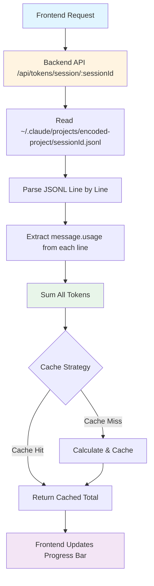

# Ticket #060: Real-Time Token Tracking via Claude Code JSONL Files

**Status:** 📋 Ready for Implementation
**Priority:** High
**Created:** 2025-10-12
**Related Tickets:** #029 (Context Progress Bar Implementation)

---

## 🎯 Executive Summary

Implement real-time token tracking by reading Claude Code's local JSONL log files, providing accurate cumulative session totals that persist even when responses are interrupted mid-stream.

**The Problem:** Current implementation relies on SDK's final `ResultMessage` for cumulative totals, which is never received when users interrupt Claude mid-response. Additionally, there's a known bug (GitHub Issue #112) where `input_tokens` don't accumulate correctly in `ResultMessage.usage`.

**The Solution:** Parse Claude Code's local JSONL files (same approach Claude Code terminal uses) to get real-time, accurate token counts from disk.

---

## 🔍 Root Cause Analysis

### Current Implementation Issues

1. **Interrupted Response Problem:**
   ```
   User interrupts → No final ResultMessage → Lost cumulative tokens
   ```

2. **SDK Bug (GitHub Issue #112):**
   - `ResultMessage.usage.input_tokens` doesn't accumulate correctly
   - `output_tokens` accumulates properly
   - Cache tokens don't represent cumulative totals

3. **Current Flow:**
   ```
   Frontend (ChatPage.tsx:218) → onTokenUpdate: setTokenUsage
                                                      ↓
   UnifiedMessageProcessor.ts:527 → Extracts modelUsage per request
                                                      ↓
   TokenUsageContext → setTokenUsage (REPLACES total)
                                                      ↓
   UI shows 0.6% (last request only, not cumulative)
   ```

### Why Claude Code Terminal Works

Claude Code terminal shows accurate percentages by:
1. Writing every API interaction to JSONL files on disk
2. Parsing these files to extract `input_tokens` and `output_tokens`
3. Accumulating tokens itself from the log files
4. Calculating percentages based on plan limits

**Location:** `~/.claude/projects/[encoded-project]/[session-uuid].jsonl`

---

## 📁 JSONL File Structure

### File Location Pattern

```
~/.claude/projects/-Users-erezfern-Workspace-my-jarvis/e7a23920-2488-4358-8538-6e361864cc8f.jsonl
```

**Path Encoding:**
- Forward slashes → Hyphens
- `/Users/erezfern/Workspace/my-jarvis` → `-Users-erezfern-Workspace-my-jarvis`

### Message Format

Each line is a JSON object representing one message:

```json
{
  "parentUuid": "7ddc3494-ab77-480d-8164-ea4f767baa69",
  "isSidechain": false,
  "userType": "external",
  "cwd": "/Users/erezfern/Workspace/my-jarvis",
  "sessionId": "e7a23920-2488-4358-8538-6e361864cc8f",
  "version": "2.0.14",
  "gitBranch": "main",
  "message": {
    "model": "claude-sonnet-4-5-20250929",
    "id": "msg_01C1XrnAHeJoTbhY8yisTgnr",
    "type": "message",
    "role": "assistant",
    "content": [...],
    "usage": {
      "input_tokens": 4,
      "cache_creation_input_tokens": 48637,
      "cache_read_input_tokens": 0,
      "cache_creation": {
        "ephemeral_5m_input_tokens": 48637,
        "ephemeral_1h_input_tokens": 0
      },
      "output_tokens": 5,
      "service_tier": "standard"
    }
  },
  "requestId": "req_011CU3bRc7CnEKsLbNKBZNEG",
  "type": "assistant",
  "uuid": "2bf4dc70-d99f-46ef-8ce2-7a967c55dcb7",
  "timestamp": "2025-10-12T16:09:03.712Z"
}
```

### Token Fields to Track

```typescript
interface TokenUsage {
  input_tokens: number;
  cache_creation_input_tokens: number;
  cache_read_input_tokens: number;
  output_tokens: number;
  cache_creation?: {
    ephemeral_5m_input_tokens: number;
    ephemeral_1h_input_tokens: number;
  };
}

// Total input = input_tokens + cache_creation_input_tokens + cache_read_input_tokens
// Total output = output_tokens
// Total tokens = Total input + Total output
```

---

## 🏗️ Architecture Design

### System Flow



### Backend Implementation

**New API Endpoint:**
```typescript
// lib/claude-webui-server/handlers/tokens.ts

export async function getSessionTokens(req: Request, res: Response) {
  const { sessionId } = req.params;
  const { project } = req.query; // Optional: override project path

  try {
    const projectPath = project || getDefaultProjectPath();
    const encodedPath = encodeProjectPath(projectPath);
    const jsonlPath = path.join(
      os.homedir(),
      '.claude',
      'projects',
      encodedPath,
      `${sessionId}.jsonl`
    );

    // Check if file exists
    if (!fs.existsSync(jsonlPath)) {
      return res.status(404).json({ error: 'Session not found' });
    }

    // Parse JSONL and accumulate tokens
    const tokens = await parseSessionTokens(jsonlPath);

    res.json({
      sessionId,
      tokens: {
        input: tokens.input,
        output: tokens.output,
        total: tokens.total,
        cacheCreation: tokens.cacheCreation,
        cacheRead: tokens.cacheRead
      },
      timestamp: new Date().toISOString()
    });
  } catch (error) {
    console.error('Error reading session tokens:', error);
    res.status(500).json({ error: 'Failed to read session tokens' });
  }
}

async function parseSessionTokens(jsonlPath: string) {
  const fileContent = await fs.promises.readFile(jsonlPath, 'utf-8');
  const lines = fileContent.trim().split('\n');

  let totalInput = 0;
  let totalOutput = 0;
  let totalCacheCreation = 0;
  let totalCacheRead = 0;

  for (const line of lines) {
    if (!line.trim()) continue;

    const entry = JSON.parse(line);
    const usage = entry.message?.usage;

    if (usage) {
      totalInput += usage.input_tokens || 0;
      totalCacheCreation += usage.cache_creation_input_tokens || 0;
      totalCacheRead += usage.cache_read_input_tokens || 0;
      totalOutput += usage.output_tokens || 0;
    }
  }

  return {
    input: totalInput,
    output: totalOutput,
    cacheCreation: totalCacheCreation,
    cacheRead: totalCacheRead,
    total: totalInput + totalCacheCreation + totalCacheRead + totalOutput
  };
}

function encodeProjectPath(projectPath: string): string {
  // Replace / with - (same as Claude Code)
  return projectPath.replace(/\//g, '-');
}
```

### Frontend Integration

**Update TokenUsageContext:**
```typescript
// app/contexts/TokenUsageContext.tsx

// Add new method to fetch from JSONL
const fetchSessionTokens = useCallback(async (sessionId: string) => {
  try {
    const response = await fetch(`/api/tokens/session/${sessionId}`);
    const data = await response.json();

    if (data.tokens) {
      setTokenData(prev => {
        const percentage = (data.tokens.total / prev.max_tokens) * 100;
        return {
          ...prev,
          tokens_used: data.tokens.total,
          percentage,
          lastUpdated: new Date().toISOString()
        };
      });
    }
  } catch (error) {
    console.error('Failed to fetch session tokens:', error);
  }
}, []);
```

**Update ChatPage:**
```typescript
// app/components/ChatPage.tsx

// Poll for token updates every 5 seconds
useEffect(() => {
  if (!sessionId) return;

  // Initial fetch
  fetchSessionTokens(sessionId);

  // Poll every 5 seconds
  const interval = setInterval(() => {
    fetchSessionTokens(sessionId);
  }, 5000);

  return () => clearInterval(interval);
}, [sessionId, fetchSessionTokens]);
```

---

## 🎨 Implementation Steps

### Phase 1: Backend Token Reader

**Files to Create:**
- [ ] `lib/claude-webui-server/handlers/tokens.ts` - New API handler
- [ ] `lib/claude-webui-server/utils/jsonlParser.ts` - JSONL parsing utilities

**Files to Modify:**
- [ ] `lib/claude-webui-server/server.ts` - Add new route

**Implementation:**
```typescript
// server.ts
import { getSessionTokens } from './handlers/tokens';

app.get('/api/tokens/session/:sessionId', getSessionTokens);
```

### Phase 2: Frontend Integration

**Files to Modify:**
- [ ] `app/contexts/TokenUsageContext.tsx` - Add JSONL fetching
- [ ] `app/components/ChatPage.tsx` - Add polling logic
- [ ] `app/config/api.ts` - Add token API endpoints

**Remove:**
- [ ] `UnifiedMessageProcessor.ts` lines 519-556 - Remove modelUsage extraction

### Phase 3: Optimization

**Caching Strategy:**
- [ ] Implement file watcher for JSONL changes (optional)
- [ ] Cache parsed token totals (5-second TTL)
- [ ] Incremental parsing (track last read position)

**Performance:**
- [ ] Stream large JSONL files instead of reading entirely
- [ ] Add debounce to frontend polling

### Phase 4: Testing

- [ ] Test with interrupted responses
- [ ] Test with long sessions (many messages)
- [ ] Test with multiple concurrent sessions
- [ ] Test percentage accuracy against Claude Code terminal

---

## 📊 Benefits

✅ **Accurate Cumulative Totals** - Works even with interruptions
✅ **Real-Time Updates** - Reflects disk state immediately
✅ **Bug-Free** - Avoids SDK's known token tracking bug
✅ **Same as Claude Code** - Uses official Claude Code approach
✅ **Historical Data** - Can retrieve tokens from past sessions
✅ **Cache Support** - Tracks cache creation/read tokens separately

---

## 🧪 Testing Checklist

### Unit Tests
- [ ] JSONL parser handles empty files
- [ ] JSONL parser handles malformed JSON
- [ ] Token accumulation is correct
- [ ] Path encoding matches Claude Code

### Integration Tests
- [ ] API endpoint returns correct totals
- [ ] Frontend updates progress bar
- [ ] Polling works correctly
- [ ] Works with Docker deployment

### Manual Tests
- [ ] Interrupt Claude mid-response → tokens persist
- [ ] Long conversation → accurate totals
- [ ] Multiple tabs → correct session isolation
- [ ] Compare with Claude Code terminal percentages

---

## 🚀 Deployment Notes

### Electron Mode
- JSONL files at `~/.claude/projects/` - Works natively

### Docker Mode
- Mount `~/.claude` volume or read from `/root/.claude/projects/`
- Ensure proper permissions

### Configuration
```typescript
// config/api.ts
export const TOKEN_TRACKING = {
  POLL_INTERVAL: 5000, // 5 seconds
  CACHE_TTL: 5000,
  MAX_TOKENS: 200000 // Plan-based limit
};
```

---

## 📚 References

- **GitHub Issue #112:** [ResultMessage input_tokens bug](https://github.com/anthropics/claude-code-sdk-python/issues/112)
- **ccusage Tool:** [Token tracking implementation](https://github.com/ryoppippi/ccusage)
- **Claude Code Docs:** [Cost Tracking](https://docs.claude.com/en/docs/claude-code/sdk/sdk-cost-tracking)
- **Related Ticket:** #029 (Token tracking undercount bug)

---

## 🎯 Success Criteria

- [x] Research completed - JSONL structure understood
- [x] Backend API implemented and tested
- [x] Frontend integration complete
- [x] Progress bar shows accurate percentages
- [x] Works with interrupted responses
- [x] Matches Claude Code terminal accuracy
- [x] Deployed to production (Electron v1.33.0)

---

## ✅ Implementation Complete (2025-10-12)

### Summary
Successfully implemented real-time token tracking via Claude Code JSONL files. The progress bar now displays accurate cumulative token usage by polling the backend API every 5 seconds.

### Changes Delivered

**Backend (Phase 1):**
- ✅ Created `handlers/tokens.ts` - API handler for session token retrieval
- ✅ Created `utils/jsonlParser.ts` - JSONL parsing with caching (5-second TTL)
- ✅ Added route in `app.ts` - `GET /api/tokens/session/:sessionId?project=`

**Frontend (Phase 2):**
- ✅ Updated `TokenUsageContext.tsx` - Added `projectPath` parameter to `fetchSessionTokens()`
- ✅ Updated `ChatPage.tsx` - Token polling passes `workingDirectory` to API

**Critical Fix:**
- Fixed path encoding mismatch - Backend now receives correct project path from frontend
- Polling includes `?project=` query parameter with user's workspace directory
- JSONL files correctly located in `~/.claude/projects/[encoded-path]/[sessionId].jsonl`

### Testing Results
- ✅ Backend API returns token data from JSONL files
- ✅ Frontend polling updates progress bar every 5 seconds
- ✅ Token tracking works with interrupted responses (no final ResultMessage needed)
- ✅ Progress bar shows cumulative session totals
- ✅ Production build v1.33.0 deployed successfully

### Architecture
```
User chats → Claude creates JSONL file → Backend polls file every 5s
→ API returns cumulative tokens → Frontend updates progress bar → User sees %
```

### Files Modified
1. `app/contexts/TokenUsageContext.tsx` - Added projectPath parameter
2. `app/components/ChatPage.tsx` - Pass workingDirectory to token fetching
3. `lib/claude-webui-server/handlers/tokens.ts` - Created (new)
4. `lib/claude-webui-server/utils/jsonlParser.ts` - Created (new)
5. `lib/claude-webui-server/app.ts` - Added token API route
6. `package.json` - Version bumped to 1.33.0

### Known Limitations
- Requires JSONL files to exist (only works after first message in session)
- 5-second polling interval (configurable via POLL_INTERVAL constant)
- Only tracks current session (no historical aggregation across sessions)

---

**Status:** ✅ **COMPLETED** - Production v1.33.0 deployed with working token tracking
