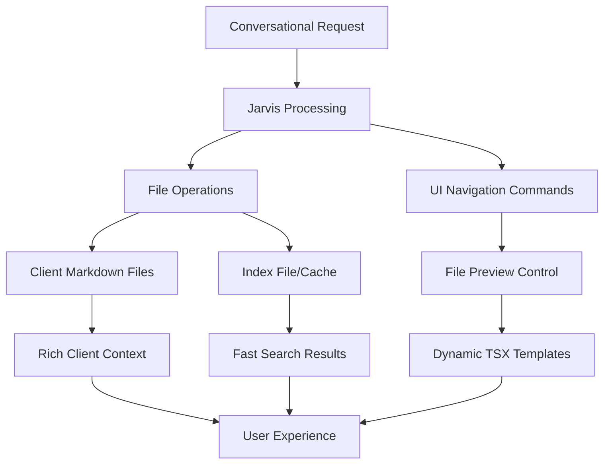
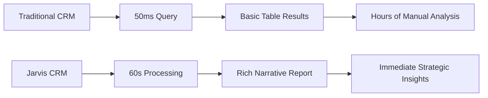
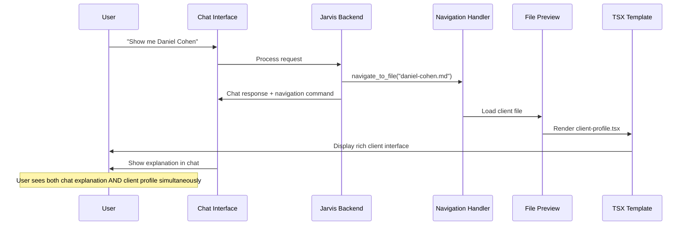

# My Jarvis CRM: Complete Architecture & Implementation Plan

**Ticket**: 088-crm-architecture-design
**Date**: 2025-11-15
**Status**: Discovery & Planning Phase
**Assignee**: Jarvis + Erez
**Priority**: High - Core Product Feature

---

## 📋 Table of Contents

1. [Executive Summary](#executive-summary)
2. [Architecture Decision](#architecture-decision)
3. [Performance Analysis](#performance-analysis)
4. [Implementation Approach](#implementation-approach)
5. [Conversational UI Control](#conversational-ui-control)
6. [Limitations & Trade-offs](#limitations--trade-offs)
7. [Implementation Roadmap](#implementation-roadmap)
8. [Open Questions](#open-questions)

---

## 🎯 Executive Summary

### The Vision
Transform My Jarvis into a revolutionary CRM platform that combines:
- **File-based rich client documents** with unlimited context
- **Conversational AI interface** for natural client management
- **Agent-controlled UI navigation** creating hybrid conversation + visual workflows
- **Simple architecture** starting with file index, scaling as needed

### Key Innovation
**"The best CRM in the world is you"** - Conversational client management where Jarvis can talk about data while simultaneously showing relevant views through programmatic UI control.

### Strategic Decision
**Start simple, scale smart**: File-based approach with intelligent optimizations, not traditional database complexity.

---

## 🏗️ Architecture Decision

### Chosen Approach: Smart File System



### File Structure
```
/workspace/crm/
├── clients/
│   ├── acme-corp.md              # Rich client documents
│   ├── healthcare-solutions.md
│   └── tech-startup-inc.md
├── index.md                      # Master client directory
├── templates/
│   ├── client-profile.tsx        # Dynamic client views
│   ├── client-list.tsx
│   ├── pipeline-dashboard.tsx
│   └── analytics-report.tsx
└── reports/
    ├── q4-pipeline.md            # Generated insights
    └── client-analysis.md
```

### Why This Architecture Wins

#### Performance Perspective
- **1000 clients**: Index file ~50KB, parse time ~1-5ms
- **Total search response**: 50-200ms (acceptable for superior output quality)
- **Value trade-off**: Slightly slower search for dramatically richer analysis and context

#### Capability Perspective
- **Rich context**: Unlimited notes, history, attachments per client
- **Conversational creation**: Natural language document generation
- **Dynamic visualization**: TSX templates create any interface
- **User ownership**: Portable files, no vendor lock-in

#### Competitive Advantage
- **No buttons philosophy**: Pure conversational interface
- **AI-controlled UI**: Jarvis navigates while explaining
- **Superior insights**: Deep analysis vs basic database queries

---

## ⚡ Performance Analysis

### Speed vs Value Trade-off



### Performance Scenarios (1000 clients)

| Operation | File-Based Time | Traditional CRM | Value Difference |
|-----------|----------------|-----------------|------------------|
| Simple search | 50-200ms | 1-10ms | Rich context vs raw data |
| Client creation | 100ms | 50ms | Conversational vs forms |
| Complex analysis | 30-60s | 10ms + hours | AI insights vs manual work |
| Report generation | 60-120s | 1s + interpretation | Narrative vs tables |

### Scale Thresholds
- **1000 clients**: Excellent performance
- **2500 clients**: Good performance (~300ms searches)
- **5000 clients**: Acceptable performance (~500ms searches)
- **10000+ clients**: Consider database migration

---

## 🚀 Implementation Approach

### Phase 1: File-Based Foundation

#### Core Components
```typescript
// CRM Service Architecture
class JarvisCRM {
  async searchClients(query: string): Promise<Client[]> {
    // 1. Parse index.md for matching metadata
    const matches = await this.parseIndex(query);

    // 2. Load rich client documents
    const clients = await Promise.all(
      matches.map(path => this.loadClientDocument(path))
    );

    return clients;
  }

  async createClient(profile: ClientProfile): Promise<void> {
    // 1. Create rich markdown document
    await this.createClientDocument(profile);

    // 2. Update master index
    await this.updateIndex(profile);
  }
}
```

#### Client Document Structure
```markdown
---
company: "Acme Corp"
industry: "Manufacturing"
status: "Active"
revenue: 250000
last_contact: "2025-11-10"
contacts:
  - name: "John Smith"
    role: "CEO"
    email: "john@acme.com"
deals:
  - name: "Q1 Implementation"
    value: 50000
    stage: "Negotiation"
---

# Acme Corp - Client Profile

## Company Overview
Leading manufacturing company specializing in...

## Recent Interactions
- **2025-11-10**: Strategy call with John Smith
- **2025-11-05**: Proposal presentation

## Current Projects
### Q1 Implementation Project
- **Value**: $50,000
- **Stage**: Negotiation
- **Next Steps**: Contract review

## Strategic Notes
[Unlimited rich context, meeting notes, strategic insights...]
```

### Phase 2: Performance Optimization

#### Smart Indexing (If Needed)
```typescript
// JSON index for faster parsing if file index becomes slow
interface ClientIndex {
  [clientId: string]: {
    file_path: string;
    company: string;
    industry: string;
    status: string;
    last_contact: string;
    revenue: number;
    tags: string[];
  }
}

// Background sync to maintain consistency
class IndexManager {
  async updateIndex(clientPath: string) {
    const metadata = await this.extractMetadata(clientPath);
    this.index[metadata.id] = metadata;
    await this.saveIndex();
  }
}
```

---

## 🎨 Conversational UI Control

### The Innovation: Agent-Driven Navigation

#### User Experience Flow
```
User: "Tell me about Daniel Cohen"

Jarvis Response:
1. [Chat] "Daniel Cohen is an active client in healthcare..."
2. [UI Navigation] Automatically loads daniel-cohen.md in file preview
3. [Template] Renders client-profile.tsx with Daniel's data
4. [User Choice] Continue conversation OR click around UI
```

### Architecture



### Tool Implementation
```typescript
// New navigation tools for Jarvis
interface NavigationTools {
  navigate_to_file: {
    file_path: string;
    template?: string;
    context?: object;
  };

  show_client_list: {
    filters?: ClientFilters;
    sort?: string;
  };

  open_dashboard: {
    view: "pipeline" | "analytics" | "activity";
    date_range?: string;
  };
}

// Frontend integration
function handleNavigationCommand(command: NavigationCommand) {
  switch (command.action) {
    case "load_file":
      setCurrentFile(command.file_path);
      setActiveTemplate(command.template);
      break;
    case "show_list":
      setViewMode("list");
      setFilters(command.filters);
      break;
  }
}
```

### Interactive Templates
```typescript
// client-profile.tsx - Rich, interactive client view
export function ClientProfile({ clientData }) {
  return (
    <div className="client-profile">
      <ClientHeader client={clientData} />

      <InteractionTimeline
        interactions={clientData.interactions}
        onAddNote={(note) => updateClientFile(note)}
      />

      <ActionButtons>
        <Button onClick={() => handleAction("call")}>Call Client</Button>
        <Button onClick={() => handleAction("email")}>Send Email</Button>
        <Button onClick={() => handleAction("schedule")}>Schedule Meeting</Button>
      </ActionButtons>

      <RelatedClients
        industry={clientData.industry}
        onClick={(client) => navigateToClient(client)}
      />
    </div>
  );
}

// client-list.tsx - Filterable, interactive client list
export function ClientList({ clients, filters }) {
  return (
    <div className="client-list">
      <FilterBar
        filters={filters}
        onFilterChange={(newFilters) => updateFilters(newFilters)}
      />

      <ClientTable
        clients={clients}
        onClientClick={(client) => navigateToProfile(client)}
        onBulkAction={(action, selectedClients) => handleBulkAction(action, selectedClients)}
      />
    </div>
  );
}
```

### Bidirectional Control
- **Conversational → UI**: "Show me healthcare clients" → Filters client list
- **UI → Conversational**: Click client → Jarvis explains their status
- **Context Awareness**: Jarvis knows what user is currently viewing

---

## ⚠️ Limitations & Trade-offs

### Honest Assessment of Downsides

#### Performance Limitations
**What takes longer**:
- Complex analytics across all clients (30-60s vs 10ms database)
- Multi-criteria searches with large datasets
- Real-time dashboard updates

**When it matters**:
- Board meeting prep requiring instant complex reports
- High-frequency operations (bulk updates)
- Real-time monitoring scenarios

#### Collaboration Constraints
**File-based challenges**:
- No ACID transactions for multi-user edits
- Manual conflict resolution vs automatic database locking
- Eventual consistency vs immediate consistency

**Mitigation strategies**:
- Shared workspace with git-like conflict resolution
- Conversational coordination: "Mike is updating ABC Corp, wait or merge?"
- Turn-based editing for complex operations

#### Scale Ceiling
**Performance degradation points**:
- 5000+ clients: Search becomes noticeably slow
- 10000+ clients: Need database migration
- High-volume operations: Bulk processing limitations

#### Integration Complexity
**Third-party challenges**:
- No standard APIs for file-based CRM data
- Custom development for each integration
- Real-time sync with external systems

### When Traditional CRM Wins
1. **Large sales teams** needing real-time collaboration
2. **Heavy analytics** requirements with complex reporting
3. **High-volume operations** with thousands of daily transactions
4. **Compliance environments** requiring detailed audit trails
5. **Mobile-first** organizations needing offline sync

### When File-Based Jarvis Wins
1. **Solo entrepreneurs** and small teams (1-3 people)
2. **Knowledge workers** prioritizing rich context over speed
3. **Strategic roles** needing deep client insights vs transaction processing
4. **Users valuing** conversation over forms and clicks
5. **Organizations wanting** data ownership and portability

---

## 📊 User-Specific Analysis: Tamar

### Profile Assessment
- **Role**: Organization leader managing ~1000 clients
- **Team**: Small organization, acts like solo entrepreneur
- **Needs**: Strategic planning, yearly planning, client relationship management

### Success Scenarios
✅ **Strategic Planning**: "Create yearly plan based on client portfolio"
✅ **Client Insights**: "What patterns do you see in our healthcare clients?"
✅ **Document Creation**: Rich, conversational document generation
✅ **Relationship Management**: Unlimited context per client relationship

### Potential Challenges
⚠️ **Board Reporting**: May need faster complex analytics
⚠️ **Team Growth**: Scaling beyond 3-4 people could hit collaboration limits
⚠️ **Mobile Access**: Less optimal than traditional mobile CRM apps
⚠️ **Integration Needs**: Accounting/marketing tool connections require custom work

### Recommendation for Tamar
**Proceed with file-based approach** because:
1. Her use case aligns with strategic/planning work vs high-volume sales
2. Rich context and conversational interface match her workflow
3. Performance acceptable for 1000 clients with strategic focus
4. Can always migrate to database later if scaling demands require it

---

## 🗺️ Implementation Roadmap

### Sprint 1-2: Foundation (Weeks 1-4)
**File-Based CRM Core**
- [ ] Client document structure and templates
- [ ] Master index.md system
- [ ] Basic search and client creation
- [ ] Simple client-profile.tsx template

**Success Criteria**: Can create and find clients conversationally

### Sprint 3-4: Navigation Control (Weeks 5-8)
**Conversational UI Integration**
- [ ] `navigate_to_file` tool implementation
- [ ] Message processor navigation commands
- [ ] Interactive TSX templates (profile, list)
- [ ] Bidirectional UI ↔ conversation control

**Success Criteria**: "Show me Daniel Cohen" loads profile + explains in chat

### Sprint 5-6: CRM Features (Weeks 9-12)
**Complete CRM Functionality**
- [ ] Client list with filtering and sorting
- [ ] Pipeline dashboard template
- [ ] Activity logging and interaction history
- [ ] Basic reporting and analytics

**Success Criteria**: Full CRM workflow for Tamar's use cases

### Sprint 7-8: Polish & Scale (Weeks 13-16)
**Performance & User Experience**
- [ ] Performance optimization (caching, smart indexing)
- [ ] Error handling and edge cases
- [ ] Mobile experience improvements
- [ ] Integration planning (accounting, email)

**Success Criteria**: Production-ready for Tamar's organization

### Future Phases: Scale Decision
**Database Migration (If Needed)**
- Evaluate performance with real usage
- Implement SQLite + MCP if file approach hits limits
- Maintain conversational interface regardless of backend

---

## ❓ Open Questions & Research

### Technical Questions

#### Q1: Index Management Strategy
**Question**: Simple index.md vs JSON vs SQLite for 1000 clients?
**Research**: Performance testing with realistic client data
**Timeline**: Sprint 1 validation

#### Q2: Template Discovery
**Question**: How does Jarvis choose which TSX template to render?
**Options**: File extension, frontmatter, content analysis, explicit parameters
**Decision needed**: Sprint 2

#### Q3: State Synchronization
**Question**: How to keep conversation and UI state consistent?
**Challenges**: Real-time updates, conflict resolution, performance
**Research**: User testing with prototype

#### Q4: Collaboration Model
**Question**: How do multiple users work with shared file system?
**Options**: Git-like, Dropbox-like, turn-based, real-time conflict resolution
**Timeline**: Sprint 6+ (after single-user validation)

### Product Questions

#### Q5: Performance Tolerance
**Question**: What response times are acceptable for strategic CRM work?
**Research**: User testing with Tamar and similar users
**Hypothesis**: 1-2 seconds acceptable, 5+ seconds problematic

#### Q6: Integration Priorities
**Question**: Which third-party integrations are must-haves vs nice-to-haves?
**Research**: Survey current users about business tool connections
**Timeline**: Sprint 8 planning

#### Q7: Mobile Strategy
**Question**: File sync vs native mobile app vs responsive web?
**Research**: User behavior analysis and mobile usage patterns
**Decision point**: After desktop validation

### Strategic Questions

#### Q8: Market Positioning
**Question**: "Conversational CRM" vs "AI Client Management" vs "Knowledge Worker CRM"?
**Research**: Competitive analysis and user language preferences
**Timeline**: Ongoing brand development

#### Q9: Scale Economics
**Question**: At what user/client scale does database migration become necessary?
**Research**: Performance benchmarking and cost analysis
**Decision framework**: Clear migration triggers

---

## 🎯 Success Criteria & KPIs

### Technical Success
- [ ] **Performance**: <200ms search response for 1000 clients
- [ ] **Reliability**: 99%+ uptime for file operations
- [ ] **User Experience**: Seamless conversation ↔ UI transitions
- [ ] **Feature Parity**: Core CRM functions work conversationally

### User Experience Success
- [ ] **Adoption**: Tamar uses daily for client management
- [ ] **Preference**: Users choose conversation over traditional CRM interface
- [ ] **Efficiency**: 50%+ faster client document creation
- [ ] **Satisfaction**: NPS >70 from early users

### Business Success
- [ ] **Differentiation**: Feature becomes competitive moat
- [ ] **Expansion**: Other users request CRM functionality
- [ ] **Foundation**: Architecture enables other use cases (project management, etc.)
- [ ] **Revenue**: Justifies development investment through user value

---

## 🚀 Next Actions

### Immediate (This Week)
1. **Validate with Tamar**: Confirm use cases and performance expectations
2. **Prototype MVP**: Basic client file creation and search
3. **Architecture Review**: Technical feasibility with current codebase
4. **Performance Baseline**: Test file parsing speeds with mock data

### Sprint 1 Kickoff
1. **Client Document Format**: Finalize markdown structure and metadata
2. **Index Strategy**: Implement and test simple index.md approach
3. **Basic Templates**: Create client-profile.tsx wireframe
4. **Tool Integration**: Implement first navigation commands

### Strategic Planning
1. **User Research**: Interview other potential CRM users
2. **Competitive Analysis**: Study conversational interfaces in business tools
3. **Integration Roadmap**: Prioritize third-party connections
4. **Scale Planning**: Define database migration triggers

---

## 📝 Conclusion

The file-based CRM with conversational UI control represents a fundamental innovation in human-AI interaction. By trading marginal performance for dramatically superior user experience and insight quality, we're creating something that doesn't exist in the market.

**The key insight**: For knowledge workers and strategic roles, the value of rich context and conversational interaction far outweighs the cost of slightly slower database operations.

**Success depends on**:
1. **Proving the concept** with users like Tamar
2. **Delivering exceptional UX** that makes speed differences irrelevant
3. **Building the right abstractions** for future scaling

**This isn't just a CRM - it's a new paradigm for AI-powered business applications where conversation and interface merge into something entirely new.**

---

*Last Updated: 2025-11-15*
*Status: Ready for prototype development*
*Next Review: After Sprint 1 completion*