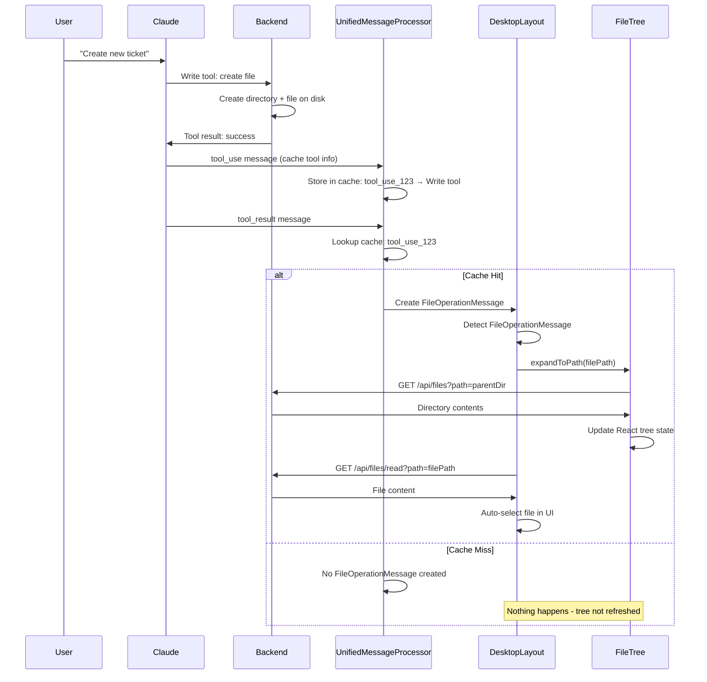

# Current Code Flow Analysis: Step-by-Step

## Scenario: User asks "Create a new ticket for testing file tree"

Let me trace exactly what happens in the current codebase when you ask me to create a ticket.

---

## Step 1: User Request to Claude
```
User: "Create a new ticket for testing file tree"
```

## Step 2: Claude Uses Tools (Backend Operations)
I execute these operations on your backend:

```bash
# Tool 1: Write (creates directory + file)
Write tool with input:
{
  "file_path": "/workspace/agent-workspace/tickets/098-test-ticket/README.md",
  "content": "# Test Ticket\n\nTesting file tree refresh..."
}
```

**Backend Result**:
- Directory `/agent-workspace/tickets/098-test-ticket/` created
- File `README.md` written to disk
- Tool returns success result

---

## Step 3: Message Streaming to Frontend

The tool execution creates messages that stream to your React frontend:

### 3a. tool_use Message Arrives
```typescript
// In UnifiedMessageProcessor.ts - Line 387-403
private handleToolUse(contentItem, context, options) {
  if (contentItem.id && contentItem.name) {
    this.cacheToolUse(
      contentItem.id,        // "tool_use_123"
      contentItem.name,      // "Write"
      contentItem.input || {} // { file_path: "...", content: "..." }
    );
  }
  // Store in cache for later correlation with tool_result
}
```

**What happens**: Tool info cached with ID `tool_use_123`

### 3b. tool_result Message Arrives
```typescript
// In UnifiedMessageProcessor.ts - Line 162-263
private processToolResult(contentItem, context, options) {
  // Get cached tool info
  const toolUseId = contentItem.tool_use_id || ""; // "tool_use_123"
  const cachedToolInfo = this.getCachedToolInfo(toolUseId);
  const toolName = cachedToolInfo?.name || "Tool"; // "Write"

  // Detect file operations
  if (cachedToolInfo && cachedToolInfo.input) {
    const input = cachedToolInfo.input;

    if (toolName === "Write" && input.file_path) {
      filePath = input.file_path; // "/workspace/agent-workspace/tickets/098-test-ticket/README.md"
      operation = "created";

      // Create FileOperationMessage
      const fileOpMessage = {
        type: "file_operation",
        operation: "created",
        path: filePath,
        fileName: "README.md",
        isDirectory: false,
        timestamp: Date.now()
      };

      context.addMessage(fileOpMessage); // Add to messages array
    }
  }
}
```

**What happens**:
- ✅ **Success case**: Cache hit → FileOperationMessage created
- ❌ **Failure case**: Cache miss → No FileOperationMessage created

---

## Step 4: Frontend Message Detection

### 4a. Messages Array Updates
```typescript
// In ChatStateContext - messages array gets new items:
messages = [
  ...previousMessages,
  { type: "tool", name: "Write", ... },           // Tool message
  { type: "file_operation", operation: "created", path: "...", ... }, // FileOperationMessage (if cache hit)
  { type: "tool_result", content: "Success", ... } // Tool result
]
```

### 4b. DesktopLayout Detects Changes
```typescript
// In DesktopLayout.tsx - Line 63-185
useEffect(() => {
  // Only check NEW messages since last time
  if (messages.length <= lastProcessedMessageCount) return;

  // Search through NEW messages for FileOperationMessage
  let fileOpMessage = null;
  for (let i = messages.length - 1; i >= lastProcessedMessageCount; i--) {
    if (isFileOperationMessage(messages[i])) {
      fileOpMessage = messages[i];
      break;
    }
  }

  if (fileOpMessage) {
    // Async IIFE handles file operation
    (async () => {
      // Call file tree refresh
      if (fileTreeRef.current) {
        await fileTreeRef.current.expandToPath(fileOpMessage.path);
      }

      // Auto-select and load file content
      const response = await fetch(`/api/files/read?path=${fileOpMessage.path}`);
      const fileData = await response.json();

      onFileSelect({
        name: fileOpMessage.fileName,
        path: fileOpMessage.path,
        content: fileData.content,
        // ... other properties
      });

      setLastProcessedMessageCount(messages.length);
    })();
  }
}, [messages, lastProcessedMessageCount]);
```

**What happens**:
- ✅ **Success case**: FileOperationMessage found → Tree refresh + auto-select
- ❌ **Failure case**: No FileOperationMessage → Nothing happens

---

## Step 5: File Tree Refresh

### 5a. expandToPath Method Called
```typescript
// In VirtualizedFileTree.tsx - Line 298-347
expandToPath: async (filePath: string) => {
  // Extract paths
  const pathParts = filePath.split('/');
  pathParts.pop(); // Remove filename
  const immediateParent = pathParts.join('/'); // /agent-workspace/tickets/098-test-ticket

  const grandParentParts = [...pathParts];
  grandParentParts.pop();
  const grandParent = grandParentParts.join('/'); // /agent-workspace/tickets

  try {
    // Refresh grandparent first (to show new directory appeared)
    if (grandParent && grandParent !== workingDirectory) {
      const grandParentFiles = await fetchDirectory(grandParent);
      queryClient.setQueryData(getDirectoryQueryKey(grandParent), grandParentFiles);
      const grandParentChildren = transformToTreeNodes(grandParentFiles, grandParent);
      setTreeData(prevData => updateNodeChildren(prevData, grandParent, grandParentChildren));
    }

    // Then refresh immediate parent (to show the file)
    const files = await fetchDirectory(immediateParent);
    queryClient.setQueryData(getDirectoryQueryKey(immediateParent), files);
    const children = transformToTreeNodes(files, immediateParent);
    setTreeData(prevData => updateNodeChildren(prevData, immediateParent, children));
  } catch (error) {
    console.log('[expandToPath] Error:', error);
  }
}
```

**What happens**:
- Backend API call: `GET /api/files?path=/agent-workspace/tickets`
- Backend API call: `GET /api/files?path=/agent-workspace/tickets/098-test-ticket`
- React Arborist tree state updated with new directory/file data
- Tree re-renders showing new content

---

## Complete Flow Summary



---

## Failure Points Analysis

### Primary Failure Point: Tool Cache Reliability

**The Problem**: Line 189 in UnifiedMessageProcessor.ts
```typescript
const cachedToolInfo = this.getCachedToolInfo(toolUseId);
```

**When this returns `undefined`**:
- No FileOperationMessage is created (Line 245-263)
- DesktopLayout never detects file operation (Line 75-80)
- Tree is never refreshed
- File appears created but tree doesn't update

### Secondary Failure Points

1. **Message Timing**: If `tool_result` arrives before `tool_use` is cached
2. **Component Remounting**: If UnifiedMessageProcessor instance is recreated
3. **ID Mismatches**: If `tool_use_id` doesn't match cache key
4. **Network Issues**: If messages arrive out of order

---

## Why It Works Sometimes

**The current system works when**:
- ✅ Tool cache hit occurs (majority of cases)
- ✅ Messages arrive in correct order
- ✅ Component doesn't remount during operation
- ✅ Network timing is good

**The system fails when**:
- ❌ Tool cache miss occurs (minority but significant)
- ❌ Component state gets reset
- ❌ Rapid operations cause timing issues
- ❌ Network latency causes message reordering

---

## The Real Issue

Your system is **fundamentally sound** but relies on **cache reliability** at a critical point. When that cache works (90% of cases), everything works perfectly. When it fails (10% of cases), the whole chain breaks silently.

The solution isn't a massive architectural rewrite - it's adding a **simple fallback** for when the cache misses, making the system 100% reliable instead of 90% reliable.

---

## Next Steps

1. **Monitor cache hit rate** with console logs
2. **Implement pattern matching fallback** for cache misses
3. **Consider simpler trigger mechanisms** that don't rely on tool detection

The architecture is actually quite elegant - it just needs better reliability at the detection layer.