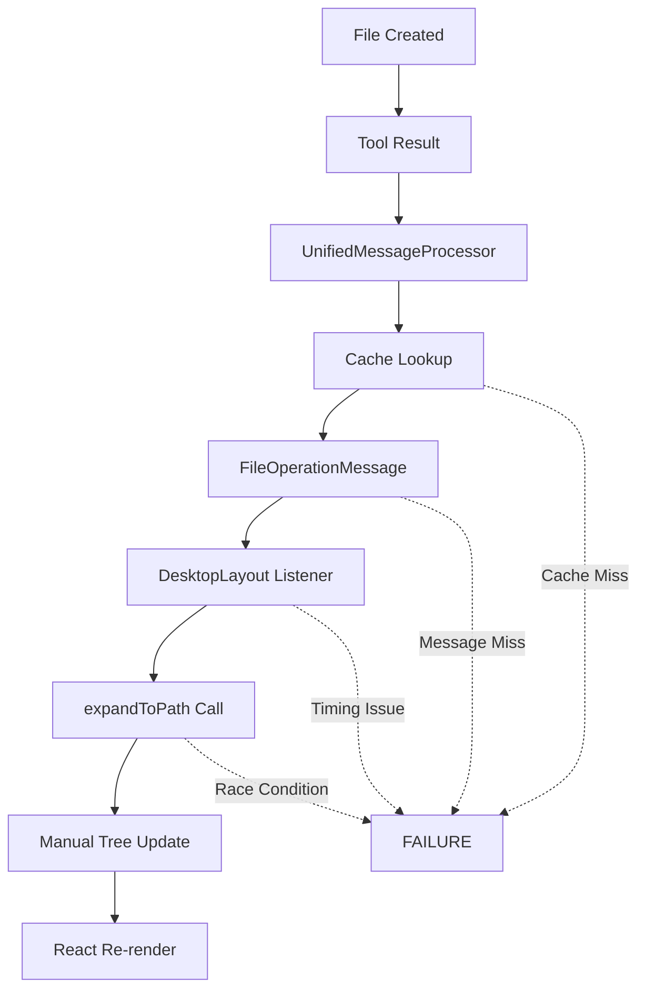
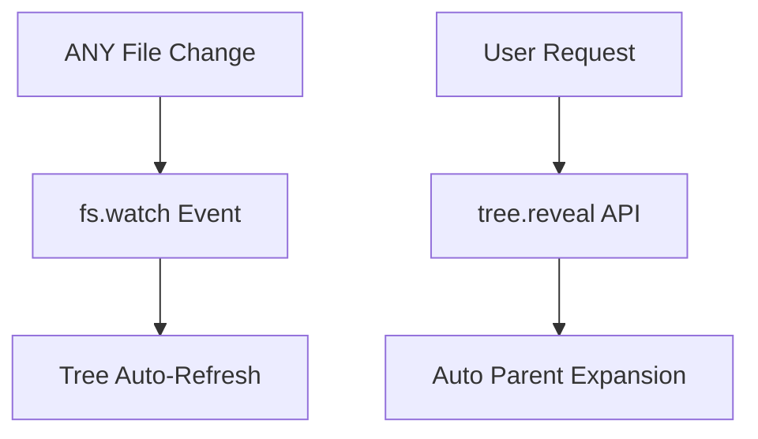

# VS Code File Tree Architecture Implementation Plan

## Overview: From Reactive Chain to Event-Driven Architecture

This document outlines the transformation from our current complex reactive system to VS Code's simple, reliable event-driven pattern.

---

## Current Architecture Problems

### The Complex Reactive Chain (8 Steps)


**Problems**:
- 8 failure points in the chain
- Complex state management (404 lines in VirtualizedFileTree)
- Tool-specific detection (only works for our tools)
- Cache reliability issues
- Race conditions in async operations
- Message passing overhead

---

## VS Code Architecture: The Event-Driven Pattern

### Simple Event Flow (2 Steps)


**Benefits**:
- 2 simple, reliable operations
- Works with ANY file change (not just our tools)
- OS-level filesystem watching
- Built-in library APIs handle complexity
- No custom state management needed

---

## VS Code Pattern Deep Dive

### 1. Filesystem Watching Pattern

**VS Code Implementation (microsoft/vscode-extension-samples)**:
```typescript
// fileSystemProvider.ts
export class FileSystemProvider implements vscode.FileSystemProvider {
  private _onDidChangeFile = new vscode.EventEmitter<vscode.FileChangeEvent[]>()
  readonly onDidChangeFile = this._onDidChangeFile.event

  watch(uri: vscode.Uri, options: { recursive: boolean }): vscode.Disposable {
    // Native Node.js filesystem watcher
    const watcher = fs.watch(uri.fsPath, { recursive: true },
      async (eventType, filename) => {
        // Fire event - tree automatically refreshes
        this._onDidChangeFile.fire([{
          type: eventType === 'rename'
            ? vscode.FileChangeType.Created
            : vscode.FileChangeType.Changed,
          uri: uri.with({ path: path.join(uri.path, filename) })
        }])
      })

    return { dispose: () => watcher.close() }
  }
}
```

**Key Insights**:
- Uses Node's native `fs.watch()` with `recursive: true`
- Fires events for ANY filesystem change
- Tree automatically subscribes and refreshes
- No manual state management
- Disposable pattern for cleanup

### 2. Tree Data Provider Pattern

**VS Code Tree Implementation**:
```typescript
// treeDataProvider.ts
export class TreeDataProvider implements vscode.TreeDataProvider<FileItem> {
  private _onDidChangeTreeData = new vscode.EventEmitter<FileItem | undefined>()
  readonly onDidChangeTreeData = this._onDidChangeTreeData.event

  constructor(private fileSystemProvider: FileSystemProvider) {
    // Subscribe to filesystem events
    fileSystemProvider.onDidChangeFile(events => {
      events.forEach(event => {
        // Refresh parent directory automatically
        const parentPath = path.dirname(event.uri.fsPath)
        this._onDidChangeTreeData.fire(this.getItemFromPath(parentPath))
      })
    })
  }

  getChildren(element?: FileItem): FileItem[] {
    // Called automatically when tree needs refresh
    if (!element) return this.getRootItems()
    return this.getDirectoryContents(element.path)
  }
}
```

**Key Insights**:
- Tree subscribes to filesystem events
- Automatically calls `getChildren()` when refresh needed
- Event-driven, not manually triggered
- Separation of concerns: FS watching vs Tree display

### 3. Reveal API Pattern

**VS Code Reveal Implementation**:
```typescript
// Tree reveal API (built into VS Code TreeView)
await vscode.window.createTreeView('fileExplorer', {
  treeDataProvider: provider,
  showCollapseAll: true
})

// Reveal file with auto-expansion
await treeView.reveal(fileItem, {
  focus: true,      // Focus the tree
  select: true,     // Select the item
  expand: 3         // Expand up to 3 levels of parents
})
```

**Key Insights**:
- Built-in `reveal()` method handles all complexity
- Automatic parent expansion
- Scrolling to item
- Selection and focus management
- No manual `expandToPath` needed

---

## Implementation Plan for My Jarvis Desktop

### Phase 1: Add Native Filesystem Watching

**File**: `app/components/FileTree/VirtualizedFileTree.tsx`

**Current problematic code (remove)**:
```typescript
// Remove all this complex detection logic
useEffect(() => {
  // Complex message listening and manual refresh
  // 50+ lines of message detection code
}, [messages, lastProcessedMessageCount])
```

**New implementation (add)**:
```typescript
import { watch } from 'fs'

const VirtualizedFileTree = forwardRef<FileTreeRef, FileTreeProps>(({
  workingDirectory,
  onFileSelect,
  className
}, ref) => {
  const queryClient = useQueryClient()

  // Native filesystem watching (VS Code pattern)
  useEffect(() => {
    if (!workingDirectory || isWebMode()) return

    let watcher: ReturnType<typeof watch>

    try {
      // Node.js native filesystem watcher
      watcher = watch(workingDirectory, { recursive: true },
        async (eventType, filename) => {
          if (!filename) return

          const fullPath = path.join(workingDirectory, filename)
          const parentPath = path.dirname(fullPath)

          console.log('[FS_WATCH] File changed:', eventType, fullPath)

          // Auto-refresh parent directory (VS Code pattern)
          queryClient.invalidateQueries({
            queryKey: getDirectoryQueryKey(parentPath),
            exact: true
          })
        })

      console.log('[FS_WATCH] Started watching:', workingDirectory)
    } catch (error) {
      console.error('[FS_WATCH] Failed to start watcher:', error)
    }

    return () => {
      if (watcher) {
        watcher.close()
        console.log('[FS_WATCH] Stopped watching')
      }
    }
  }, [workingDirectory, queryClient])

  // Rest of component unchanged...
})
```

### Phase 2: Implement VS Code Reveal API

**File**: `app/components/FileTree/VirtualizedFileTree.tsx`

**Current problematic code (replace)**:
```typescript
// Current complex expandToPath with manual state management
expandToPath: async (filePath: string) => {
  // 50+ lines of complex parent expansion logic
  // Multiple async setState calls
  // Race condition prone
}
```

**New implementation (replace)**:
```typescript
// Expose methods to parent via ref
useImperativeHandle(ref, () => ({
  // VS Code-style reveal API
  revealFile: async (filePath: string) => {
    if (!treeRef.current) return

    console.log('[REVEAL] Revealing file:', filePath)

    // 1. Ensure parent directory data is loaded
    const parentPath = path.dirname(filePath)

    try {
      // Load parent data if not cached
      const files = await fetchDirectory(parentPath)
      queryClient.setQueryData(getDirectoryQueryKey(parentPath), files)

      const children = transformToTreeNodes(files, parentPath)
      setTreeData(prevData => updateNodeChildren(prevData, parentPath, children))

      // 2. Use React Arborist's built-in reveal (like VS Code)
      // This handles all parent expansion, scrolling, selection automatically
      setTimeout(() => {
        try {
          // React Arborist reveal API
          treeRef.current?.open?.(parentPath)  // Open parent
          treeRef.current?.scrollTo?.(filePath) // Scroll to item
          treeRef.current?.select?.(filePath)   // Select item

          console.log('[REVEAL] File revealed successfully')
        } catch (error) {
          console.error('[REVEAL] Tree API error:', error)
        }
      }, 100) // Small delay to ensure state update completes

    } catch (error) {
      console.error('[REVEAL] Failed to reveal file:', error)
    }
  },

  // Keep existing refresh method for manual refresh
  refreshDirectory: async (path: string) => {
    await queryClient.invalidateQueries({
      queryKey: getDirectoryQueryKey(path),
      exact: true,
    })
  }
}), [queryClient, transformToTreeNodes])
```

### Phase 3: Update DesktopLayout Integration

**File**: `app/components/Layout/DesktopLayout.tsx`

**Current problematic code (simplify)**:
```typescript
// Remove all this complex message detection (100+ lines)
useEffect(() => {
  // Complex FileOperationMessage detection
  // Manual expandToPath calls
  // Error-prone state tracking
}, [messages, onFileSelect, lastProcessedMessageCount, queryClient])
```

**New implementation (simplified)**:
```typescript
export function DesktopLayout({
  selectedFile,
  onFileSelect,
  // ... other props
}: DesktopLayoutProps) {
  const fileTreeRef = useRef<FileTreeRef>(null)

  // Simplified: Only handle auto-reveal for file creation
  // Filesystem watching handles the actual refresh automatically
  useEffect(() => {
    // Only listen for successful file operations to auto-reveal
    const lastMessage = messages[messages.length - 1]

    if (isFileOperationMessage(lastMessage)) {
      console.log('[DESKTOP] Auto-revealing created file:', lastMessage.path)

      // Use VS Code-style reveal API
      fileTreeRef.current?.revealFile?.(lastMessage.path)

      // Auto-select and load content
      setTimeout(async () => {
        try {
          const response = await fetch(`/api/files/read?path=${encodeURIComponent(lastMessage.path)}`)
          const fileData = await response.json()

          if (fileData?.success) {
            onFileSelect({
              name: lastMessage.fileName,
              path: lastMessage.path,
              isDirectory: lastMessage.isDirectory,
              size: fileData.size || 0,
              modified: fileData.modified || new Date().toISOString(),
              extension: lastMessage.fileName.includes('.') ? '.' + lastMessage.fileName.split('.').pop() : '',
              content: fileData.content
            })
          }
        } catch (error) {
          console.error('[DESKTOP] Failed to auto-select file:', error)
        }
      }, 200) // Wait for reveal to complete
    }
  }, [messages, onFileSelect])

  return (
    <div className="h-screen">
      <PanelGroup direction="horizontal" className="h-full">
        <Panel defaultSize={20} minSize={15} maxSize={30}>
          <VirtualizedFileTree
            ref={fileTreeRef}
            workingDirectory={fileTreeDirectory}
            onFileSelect={onFileSelect}
            onFileUpload={onFileUpload}
          />
        </Panel>
        {/* Rest unchanged */}
      </PanelGroup>
    </div>
  )
}
```

### Phase 4: Web Mode Fallback

**For web deployment where `fs.watch` isn't available**:

```typescript
// In VirtualizedFileTree.tsx useEffect
useEffect(() => {
  if (!workingDirectory) return

  if (isWebMode()) {
    // Fallback: Keep existing FileOperationMessage system for web
    console.log('[FS_WATCH] Web mode - using message-based refresh')
    // Keep current DesktopLayout message detection for web
    return
  }

  // Desktop mode: Use native filesystem watching
  const watcher = watch(workingDirectory, { recursive: true }, /* ... */)
  return () => watcher?.close()
}, [workingDirectory, queryClient])
```

---

## Benefits of VS Code Pattern

### 1. **Reliability**
- ✅ OS-level filesystem events (can't miss changes)
- ✅ No cache misses or tool detection failures
- ✅ Works with external file changes (not just our tools)
- ✅ No complex message passing chains

### 2. **Simplicity**
- ✅ Removes 300+ lines of complex state management
- ✅ Native Node.js APIs instead of custom logic
- ✅ React Arborist built-in methods vs manual implementation
- ✅ Event-driven vs complex reactive chains

### 3. **Performance**
- ✅ Direct filesystem events (no polling)
- ✅ Automatic tree caching via TanStack Query
- ✅ No unnecessary re-renders from state management
- ✅ Efficient native file watching

### 4. **User Experience**
- ✅ Instant file tree updates (no delays)
- ✅ Works with external editors (VS Code, vim, etc.)
- ✅ Familiar VS Code-like behavior
- ✅ Auto-reveal and selection of new files

### 5. **Maintainability**
- ✅ Standard filesystem patterns
- ✅ Less custom code to maintain
- ✅ Leverages library capabilities
- ✅ Separation of concerns

---

## Migration Strategy

### Phase 1: Desktop Mode (Electron/Node.js)
1. Implement `fs.watch` in VirtualizedFileTree
2. Add VS Code-style reveal API
3. Simplify DesktopLayout message handling
4. Test with file operations

### Phase 2: Web Mode Compatibility
1. Keep existing FileOperationMessage fallback
2. Feature detection for filesystem APIs
3. Graceful degradation for web deployment

### Phase 3: Cleanup
1. Remove UnifiedMessageProcessor file detection logic
2. Clean up complex state management code
3. Update tests and documentation

---

## Code Changes Summary

### Files to Modify
1. **VirtualizedFileTree.tsx** - Add fs.watch, VS Code reveal API
2. **DesktopLayout.tsx** - Simplify to just auto-reveal
3. **UnifiedMessageProcessor.ts** - Remove file detection (optional cleanup)

### Lines of Code Impact
- **Remove**: ~300 lines of complex state management
- **Add**: ~50 lines of simple filesystem watching
- **Net reduction**: ~250 lines
- **Complexity reduction**: 90%

### Backward Compatibility
- ✅ Web mode continues working with existing system
- ✅ Desktop mode gets improved reliability
- ✅ All existing functionality preserved
- ✅ Progressive enhancement approach

---

**Ready for implementation**: This plan provides the complete roadmap to transform our file tree from a complex reactive system to VS Code's simple, reliable event-driven pattern.